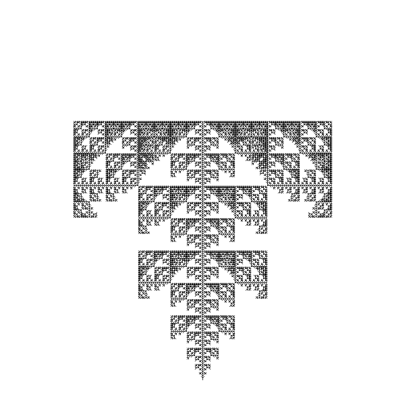

# L-SYSTEM TREE FRACTAL GENERATOR
**Programming Language:** Rust\
**Team Members:** Matthew Shaw, Logan Bane, Cody Stanley, Michael Gohn, Brandon Norton 

## HOW TO RUN
- To run our project, you will first need to download Rust
  - It can be found at https://rust-lang.org/tools/install/
  - This will include Rust's permissions and package manager/builder: cargo
- Next, you will need to clone or download the source code
- After that, run `cargo run` within the folder of the project to compile/build the project
- Next, the following should be shown to establish the axiom (initial string) and the number of iterations:\
  
- Finally, the output will be saved to `output.png`\
 An example is found below:

